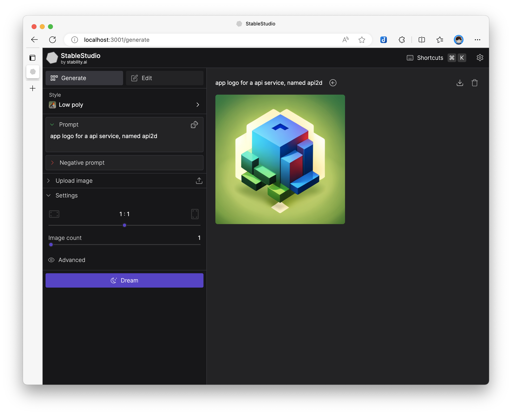
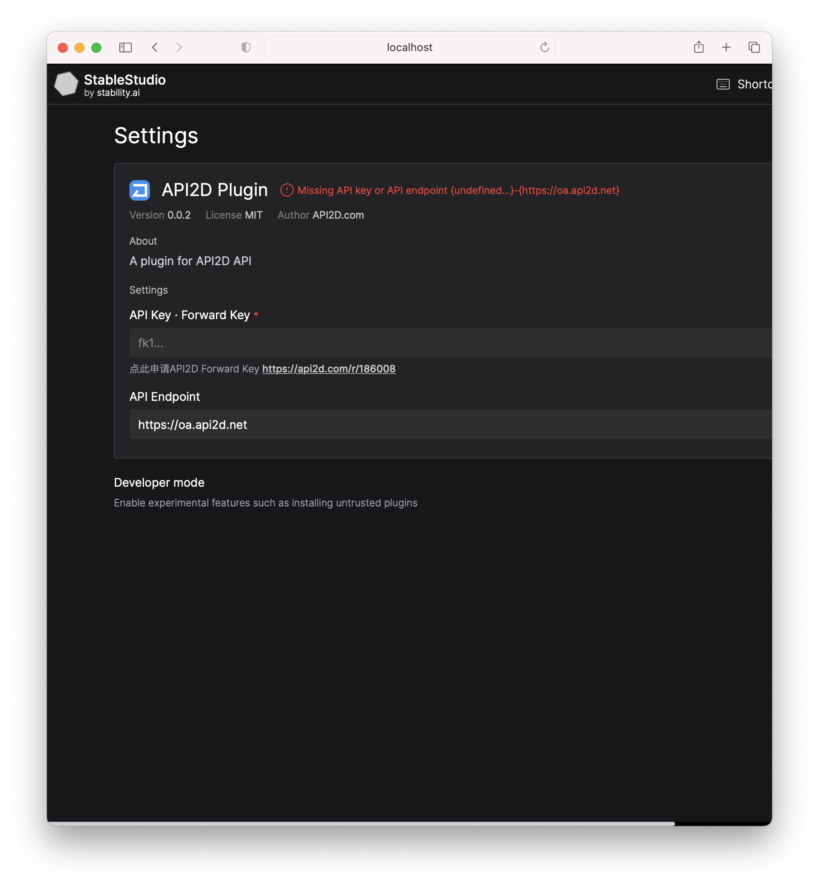

# 2dstudio-dist

使用 API2D Key 的 Stable Studio，

🌌 [点这里在线试用](https://s.level06.com/)

本仓库为独立部署版





## 部署使用

本项目为纯静态网页，直接部署到web目录下即可使用

### Vercel 一键部署

[](https://vercel.com/new/clone?repository-url=https%3A%2F%2Fgithub.com%2Feasychen%2F2dstudio-dist.git&root-directory=build)


### Docker 一键部署

```bash
docker run -d -p 9000:9000  easychen/2dstudio
```

### Web目录或对象存储

将 `build.zip` 解压，然后放置到web目录或者对象存储中即可


